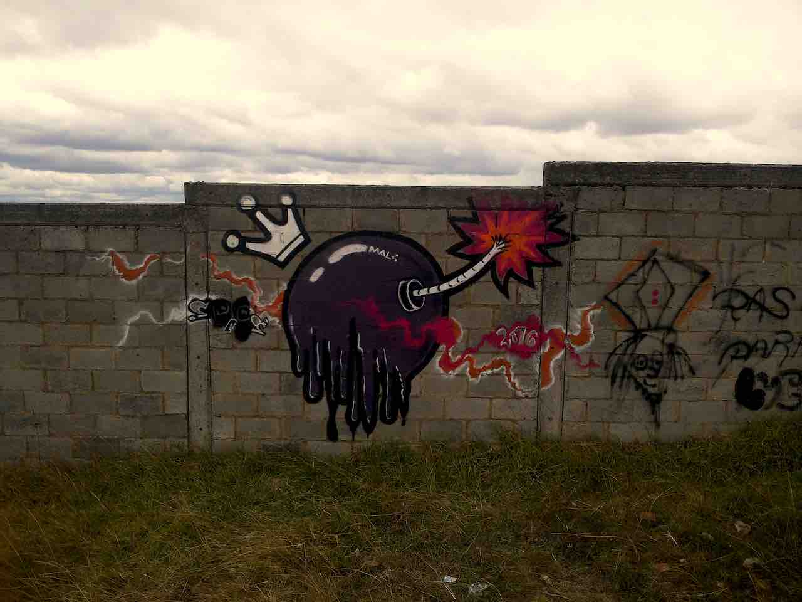

>*«Quien no conoce a su enemigo, está condenado a convertirse en su esclavo.» —@LocoLocalista* 

Imagen: Somos Bomba. Fuente: [somos2013, CC BY 2.0](https://flickr.com/somos2013){:target="_blank"}

<strong>País Bomba:</strong>
     
Colombia es un cofre del tesoro con temporizador; vivimos en un país bomba que fue capturado y activado por varios grupitos de intolerantes desarraigados.

Pero hay también unos cuantos locos éticos cortándole cables y 
formas de autogobierno en crecimiento.

Ir a [Introducción a País Bomba.](/intro-parte-i)

<cite>
«Ten presente que no busco ni que me apruebes ni 
influenciarte[...] Quedaré más que satisfecho si empiezas a 
aprender a investigar todo por ti mismo de ahora en adelante.» 
—Bruce Lee</cite>

La presente información expresa mis avances estudiando el Incerto en mi tiempo libre, esta historia está llena de huecos y viene sin garantía. La toman, la dejan, locos, el exceso de confianza es perjudicial para la salud. Antes de consumir consulte con la almohada. Suspenda su uso si se presentan reacciones adversas. Los errores son míos, así como es mío el derecho a contradecirme. Ante una contradicción, rompa el vidrio y tome la afirmación más reciente.Declaro que no tengo ningún conflicto de interés potencial con este proyecto.

<strong>Acataléptico:</strong>
     
Actualmente no vivo en Colombia. Soy un pensador independiente y autodidacta. Sin afiliación alguna más que la de ser latino y colombiano. Un paisa en la lejanía a quien el #Incerto de N.Taleb lo picó en 2012 y no ha parado de leerlo.
Mi foco hoy es en prepararme para exponer a los charlatanes e idiotas que usan el verbalismo, el cientificismo, y la intimidación como argumento, al servicio de sus propósitos corruptos de mantener el poder y beneficiarse de la guerra.

Gracias por leerme, a veces hablo muy por encima, pero sepan que estoy preparado para esclarecer, o cuestionar, los conceptos que uso. Escríbanme sin pena, no serían mis amigos si no me critican locos, si no me hacen pensar. En Twitter: [@acataleptico](https://twitter.com/acataleptico){:target="_blank"} o a mi correo electrónico:

ACATALEPTICO -arroba- PM -punto- ME